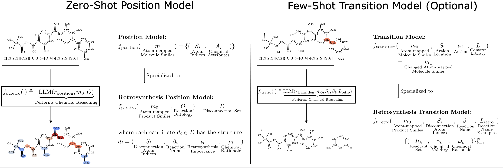
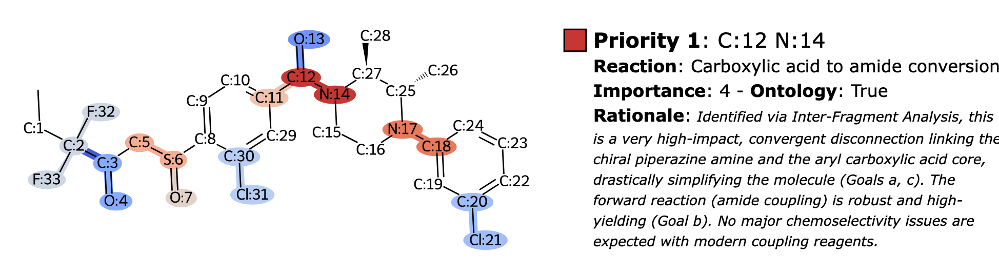

# **Atom-anchored LLMs speak Chemistry: A Retrosynthesis Demonstration** 


## Abstract
Applications of machine learning in chemistry are often limited by the scarcity and expense of labeled data, restricting traditional supervised methods. In this work, we introduce a framework for molecular reasoning using general-purpose Large Language Models (LLMs) that operates without requiring labeled training data. Our method anchors chain-of-thought reasoning to the molecular structure by using unique atomic identifiers. First, the LLM performs a one-shot task to identify relevant fragments and their associated chemical labels or transformation classes. In an optional second step, this position-aware information is used in a few-shot task with provided class examples to predict the chemical transformation.
We apply our framework to single-step retrosynthesis, a task where LLMs have previously underperformed. Across academic benchmarks and expert-validated drug discovery molecules, our work enables LLMs to achieve high success rates in identifying chemically plausible reaction sites ($\geq90\%$), named reaction classes ($\geq40\%$), and final reactants ($\geq74\%$). Beyond solving complex chemical tasks, our work also provides a method to generate theoretically grounded synthetic datasets by mapping chemical knowledge onto the molecular structure and thereby addressing data scarcity.

## General Instructions 

This project provides a two-step workflow for performing retrosynthetic analysis on a target molecule using Large Language Models (LLMs). The process is managed through two main Jupyter notebooks:

1.  **`0_position_visualization.ipynb`**: Identifies and visualizes potential strategic disconnection sites on a target molecule.
2.  **`1_transition_visualization.ipynb`**: Takes a specific disconnection site from the first step and generates potential reactant molecules for it.

To reproduce the results and plots used in the paper from raw model output files:
- **`4_position_analysis_all_models.ipynb`**: For reproducing all the figures for the *position model*.
- **`5_transition_analysis_all_models.ipynb`**: For reproducing all the figures for the *transition model*.

The notebooks generate detailed Markdown reports, CSV files, and LaTeX tables, which can be converted into styled PDF reports.




## Folder Structure

The project is organized into the following directories:

*   `data/`: Contains the context library (e.g., PaRoutes training examples) required by the transition model to find relevant reaction examples.
*   `examples/`: This is the output directory where the notebooks will save all generated files, including populated prompts, LLM responses, and final reports for each molecule.
*   `notebooks/`: Contains the two main Jupyter notebooks (`0_position_visualization.ipynb` and `1_transition_visualization.ipynb`). **Start here to run the analysis.**
*   `prompts/`: Contains the prompt templates that are populated by the notebooks to generate requests for the LLM.
*   `plots/`: Contains the main Jupyter notebooks (`0_position_visualization.ipynb` and `1_transition_visualization.ipynb`), along with notebooks for reproducing results and plots. 


## Installation

Follow these steps to set up the necessary environment to run the notebooks.

### 1. Prerequisites

Before you begin, ensure you have the following installed on your system:

*   **Conda**: You need either Anaconda or Miniconda to manage the Python environment. You can download it from [here](https://docs.conda.io/en/latest/miniconda.html).
*   **Pandoc**: This is a system dependency required for converting the generated Markdown reports into PDFs.
    *   **On macOS (using Homebrew)**:
        ```bash
        brew install pandoc
        ```
    *   **On other systems**: Follow the installation instructions on the [pandoc website](https://pandoc.org/installing.html).

### 2. Create the Conda Environment

This project uses an `environment.yml` file to ensure all required Python packages are installed with the correct versions.

1.  **Clone the repository** or make sure you are in the project's root directory where `environment.yml` is located or use the provided zip.

2.  **Create the environment** by running the following command in your terminal. This will create a new conda environment named `retro_llm` and install all dependencies.
    ```bash
    conda env create -f environment.yml
    ```

## Usage

1.  **Activate the Conda Environment**: Before running the notebooks, you must activate the environment you just created.
    ```bash
    conda activate retro_llm
    ```

2.  **Start Jupyter Lab**: With the environment active, start Jupyter Lab to open the notebooks.
    ```bash
    jupyter lab
    ```

3.  **Run the Notebooks**:
    *   Open and run the cells in `notebooks/0_position_visualization.ipynb` to analyze disconnection positions.
    *   After running the position analysis, open and run `notebooks/1_transition_visualization.ipynb` to generate reactants for a chosen position.
    *   Follow the instructions within each notebook to configure the target molecule and process the results
  
## Citation
[Citation to be added]
