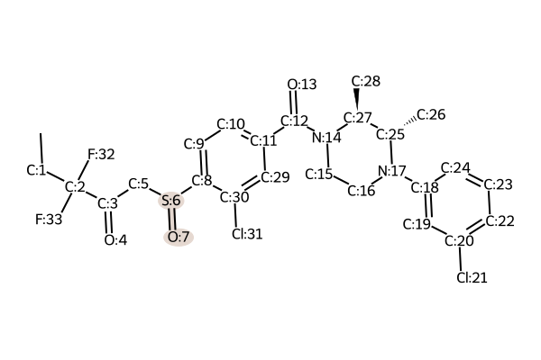
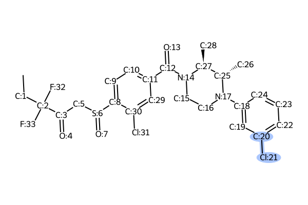
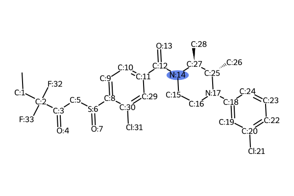

# Disconnection Position Analysis for **LEI_515**

#### Overview of All Predicted Disconnection Sites

---

\pagebreak

##### Priority 1: `C:12 N:14`

- **Forward Reaction:** Carboxylic acid to amide conversion
- **Importance Score:** `4`
- **In Ontology:** True
- **Rationale:** Identified via Inter-Fragment Analysis, this is a very high-impact, convergent disconnection linking the chiral piperazine amine and the aryl carboxylic acid core, drastically simplifying the molecule (Goals a, c). The forward reaction (amide coupling) is robust and high-yielding (Goal b). No major chemoselectivity issues are expected with modern coupling reagents.

---

##### Priority 2: `C:12 N:14`

- **Forward Reaction:** Acylation of Nitrogen Nucleophiles by Acyl/Thioacyl/Carbamoyl Halides and Analogs_N
- **Importance Score:** `4`
- **In Ontology:** True
- **Rationale:** Identified via Inter-Fragment Analysis, this is a very high-impact, convergent disconnection that simplifies the molecule into two key fragments (Goals a, c). Activation of the carboxylic acid as an acyl chloride is a classic, robust method for amide formation (Goal b), though it may require protection of other nucleophilic sites.

---

##### Priority 3: `N:17 c:18`

- **Forward Reaction:** Buchwald-Hartwig/Ullmann-Goldberg/N-arylation secondary amine
- **Importance Score:** `4`
- **In Ontology:** True
- **Rationale:** Identified via Inter-Fragment Analysis, this key convergent C-N bond formation builds the N-arylpiperazine motif (Goal c). The forward reaction, a Buchwald-Hartwig amination, is a powerful and reliable method for this transformation, simplifying the chiral amine precursor (Goals a, b). Potential for competitive reaction at N:14 necessitates a protecting group strategy.

---

##### Priority 4: `N:17 c:18`

- **Forward Reaction:** N-arylation (Buchwald-Hartwig/Ullmann-Goldberg)
- **Importance Score:** `4`
- **In Ontology:** True
- **Rationale:** Identified via Inter-Fragment Analysis, this strategic disconnection simplifies the chiral piperazine component by removing the aryl group (Goal a). The forward N-arylation is a powerful and reliable reaction for constructing this key bond (Goals b, c). Regioselectivity between the two piperazine nitrogens is a key issue that must be controlled, likely with a protecting group on N:14.

---

##### Priority 5: `C:5 S:6`

- **Forward Reaction:** S-alkylation of thiols
- **Importance Score:** `3`
- **In Ontology:** True
- **Rationale:** Identified via Strategic Bond Analysis. This disconnects the beta-keto sulfoxide side chain from the aryl core (Goal c). The forward synthesis involves S-alkylation of the corresponding thiophenol with an alpha-halo ketone precursor, followed by oxidation. This is a robust way to build this key C-S bond, but the electrophile itself requires separate synthesis (Goals a, b).

---

##### Priority 6: `c:11 C:12`

- **Forward Reaction:** Grignard with CO2 to carboxylic acid
- **Importance Score:** `3`
- **In Ontology:** True
- **Rationale:** Identified via FGI Analysis. Strategic C-C bond formation to install the carboxyl group on the central aromatic ring (Goal c). The forward synthesis via carboxylation of an organometallic (e.g., Grignard) from an aryl halide is classic and reliable (Goals a, b). Chemoselectivity is a concern, as formation of the organometallic must be compatible with the sulfide/sulfoxide group.

---

##### Priority 7: `S:6 O:7`

- **Forward Reaction:** Sulfanyl to sulfinyl_H2O2
- **Importance Score:** `2`
- **In Ontology:** True
- **Rationale:** Identified via FGI Analysis. Standard FGI to install the sulfoxide from a more stable and easier to handle sulfide precursor. The oxidation can be performed late-stage, but requires careful control of conditions to prevent over-oxidation to the sulfone, which presents a chemoselectivity challenge (Goal b).

---

##### Priority 8: `C:2 F:32 F:33`

- **Forward Reaction:** Fluorination
- **Importance Score:** `2`
- **In Ontology:** True
- **Rationale:** Identified via FGI Analysis. This disconnection corresponds to a forward reaction installing the difluoro moiety. Electrophilic fluorination of the beta-keto sulfoxide enolate is a viable route (Goal c). Chemoselectivity could be an issue due to multiple acidic protons (at C:5) and potential for mono- vs di-fluorination, requiring kinetic control.

---

##### Priority 9: `c:30 Cl:31`

- **Forward Reaction:** Aromatic chlorination
- **Importance Score:** `2`
- **In Ontology:** True
- **Rationale:** Identified via FGI Analysis. This FGI installs the chloro substituent via electrophilic aromatic substitution (Goal c). The regioselectivity of the chlorination would be directed by the existing sulfoxide/sulfide and carboxylate/amide groups. Predicting and controlling the outcome relative to other open positions on the ring requires careful consideration of the combined directing effects.

---

##### Priority 10: `c:20 Cl:21`

- **Forward Reaction:** Aromatic chlorination
- **Importance Score:** `2`
- **In Ontology:** True
- **Rationale:** Identified via FGI Analysis. This FGI installs the chloro substituent on the N-aryl ring via electrophilic aromatic substitution (Goal c). The reaction would be strongly directed by the activating amine substituent, likely leading to the observed para-chlorination, making this a reliable and predictable transformation (Goal b).

---

##### Priority 11: `C:3 O:4`

- **Forward Reaction:** Oxidation or Dehydrogenation of Alcohols to Aldehydes and Ketones
- **Importance Score:** `2`
- **In Ontology:** True
- **Rationale:** Identified via FGI analysis. Standard FGI to form the ketone from a secondary alcohol precursor. While many mild oxidation reagents are available, the presence of the easily oxidizable sulfoxide (or its sulfide precursor) on the same molecule presents a major chemoselectivity challenge that must be carefully managed (Goal b).

---

##### Priority 12: `C:12 O:13 N:14`

- **Forward Reaction:** Nitrile to amide
- **Importance Score:** `2`
- **In Ontology:** True
- **Rationale:** Identified via FGI analysis. This transforms the amide into a nitrile precursor, offering an alternative synthetic route to the central aromatic core (Goal a). A nitrile can be introduced via methods like the Sandmeyer reaction. The forward reaction, partial hydrolysis of the nitrile to the amide, can be challenging to stop without proceeding to the carboxylic acid.

---

##### Priority 13: `N:14`

- **Forward Reaction:** Boc amine deprotection
- **Importance Score:** `1`
- **In Ontology:** True
- **Rationale:** Identified via Protecting Group Analysis. This is a tactical deprotection step. A protecting group like Boc on N:14 would be crucial in a forward synthesis to ensure regioselective N-arylation at N:17. This step reveals the nucleophilic amine for the final amide coupling and is a common, practical consideration (Goal d).

---

##### Priority 14: `C:2 C:3`

- **Forward Reaction:** Enolate Acylation
- **Importance Score:** `3`
- **In Ontology:** False
- **Rationale:** Identified via Strategic Bond Analysis. This strategic C-C bond disconnection breaks down the beta-keto side chain (Goal a). The forward reaction, likely an enolate acylation, is a powerful method for ketone synthesis (Goal c). However, generating and controlling the reactivity and stability of the required difluoroenolate precursor could be challenging.

---
