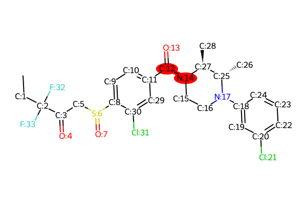
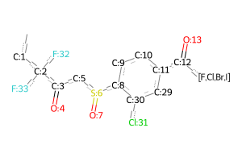
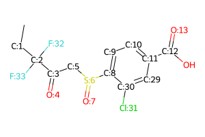
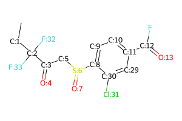
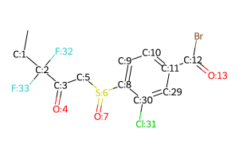
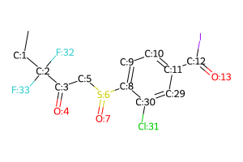

# Reaction Report for ***LEI_515***, Priority 1

**Selected Position:** `C:12 N:14`

**Selected Forward Reaction:** Carboxylic acid to amide conversion

## Product
*Reaction site highlighted at position `C:12 N:14`*


**Product SMILES:** ```C[CH2:1][C:2]([C:3](=[O:4])[CH2:5][S:6](=[O:7])[c:8]1[cH:9][cH:10][c:11]([C:12](=[O:13])[N:14]2[CH2:15][CH2:16][N:17]([c:18]3[cH:19][c:20]([Cl:21])[cH:22][cH:23][cH:24]3)[C@@H:25]([CH3:26])[C@@H:27]2[CH3:28])[cH:29][c:30]1[Cl:31])([F:32])[F:33]```

## Proposed Transitions
### Transition 1
- **Forward Reaction:** Carboxylic acid to amide conversion
- **Is Chemically Valid:** True
- **Is Template-based:** True
- **Reasoning:** This is the general template for amide formation from an acyl halide and an amine. The acyl halide provides a highly activated electrophile for reaction with the amine nucleophile. An external base is typically required to neutralize the hydrogen halide byproduct. <Class:AcylHalide>
- **Reactant 1:** `[CH3:28][C@@H:27]1[N:14](H)[CH2:15][CH2:16][N:17]([c:18]2[cH:19][c:20]([Cl:21])[cH:22][cH:23][cH:24]2)[C@@H:25]1[CH3:26]`
(Could not visualize)


- **Reactant 2:** `C[CH2:1][C:2]([C:3](=[O:4])[CH2:5][S:6](=[O:7])[c:8]1[cH:9][cH:10][c:11]([C:12](=[O:13])[F,Cl,Br,I])[cH:29][c:30]1[Cl:31])([F:32])[F:33]`



### Transition 2
- **Forward Reaction:** Carboxylic acid to amide conversion
- **Is Chemically Valid:** True
- **Is Template-based:** False
- **Reasoning:** This is the standard conceptual retrosynthetic disconnection for an amide bond. The reactants, a carboxylic acid and a secondary amine, are stable. In practice, the direct thermal reaction is inefficient; this transformation requires activation of the carboxylic acid with a peptide coupling agent (e.g., HATU, EDC, DCC). Existing stereocenters are remote and would not be affected under standard coupling conditions.
- **Reactant 1:** `[CH3:28][C@@H:27]1[N:14](H)[CH2:15][CH2:16][N:17]([c:18]2[cH:19][c:20]([Cl:21])[cH:22][cH:23][cH:24]2)[C@@H:25]1[CH3:26]`
(Could not visualize)


- **Reactant 2:** `C[CH2:1][C:2]([C:3](=[O:4])[CH2:5][S:6](=[O:7])[c:8]1[cH:9][cH:10][c:11]([C:12](=[O:13])O)[cH:29][c:30]1[Cl:31])([F:32])[F:33]`



### Transition 3
- **Forward Reaction:** Carboxylic acid to amide conversion
- **Is Chemically Valid:** True
- **Is Template-based:** False
- **Reasoning:** This is a valid and classic method for amide bond formation (e.g., Schotten-Baumann conditions). The acyl chloride is a highly activated species that will react readily with the secondary amine. An external, non-nucleophilic base (e.g., pyridine, triethylamine) is required to neutralize the HCl byproduct. The tertiary amine N:17 could also act as a base or be quaternized as a side reaction.
- **Reactant 1:** `[CH3:28][C@@H:27]1[N:14](H)[CH2:15][CH2:16][N:17]([c:18]2[cH:19][c:20]([Cl:21])[cH:22][cH:23][cH:24]2)[C@@H:25]1[CH3:26]`
(Could not visualize)


- **Reactant 2:** `C[CH2:1][C:2]([C:3](=[O:4])[CH2:5][S:6](=[O:7])[c:8]1[cH:9][cH:10][c:11]([C:12](=[O:13])Cl)[cH:29][c:30]1[Cl:31])([F:32])[F:33]`


### Transition 4
- **Forward Reaction:** Carboxylic acid to amide conversion
- **Is Chemically Valid:** True
- **Is Template-based:** False
- **Reasoning:** This permutation is valid and represents a modern approach to amide synthesis. Acyl fluorides offer a good balance of reactivity and stability, often being more chemoselective and causing less racemization at adjacent stereocenters than the corresponding chlorides. An external base is typically used.
- **Reactant 1:** `[CH3:28][C@@H:27]1[N:14](H)[CH2:15][CH2:16][N:17]([c:18]2[cH:19][c:20]([Cl:21])[cH:22][cH:23][cH:24]2)[C@@H:25]1[CH3:26]`
(Could not visualize)


- **Reactant 2:** `C[CH2:1][C:2]([C:3](=[O:4])[CH2:5][S:6](=[O:7])[c:8]1[cH:9][cH:10][c:11]([C:12](=[O:13])F)[cH:29][c:30]1[Cl:31])([F:32])[F:33]`



### Transition 5
- **Forward Reaction:** Carboxylic acid to amide conversion
- **Is Chemically Valid:** True
- **Is Template-based:** False
- **Reasoning:** This permutation is valid. Acyl bromides are highly reactive electrophiles suitable for amide formation, though they are generally more reactive and less commonly used than acyl chlorides due to stability and cost concerns. An external base is required.
- **Reactant 1:** `[CH3:28][C@@H:27]1[N:14](H)[CH2:15][CH2:16][N:17]([c:18]2[cH:19][c:20]([Cl:21])[cH:22][cH:23][cH:24]2)[C@@H:25]1[CH3:26]`
(Could not visualize)


- **Reactant 2:** `C[CH2:1][C:2]([C:3](=[O:4])[CH2:5][S:6](=[O:7])[c:8]1[cH:9][cH:10][c:11]([C:12](=[O:13])Br)[cH:29][c:30]1[Cl:31])([F:32])[F:33]`



### Transition 6
- **Forward Reaction:** Carboxylic acid to amide conversion
- **Is Chemically Valid:** True
- **Is Template-based:** False
- **Reasoning:** This permutation is chemically plausible but synthetically impractical. Acyl iodides are extremely reactive and often too unstable for isolation, making them difficult to handle and rarely used in synthesis. However, the transformation is mechanistically sound. An external base is required.
- **Reactant 1:** `[CH3:28][C@@H:27]1[N:14](H)[CH2:15][CH2:16][N:17]([c:18]2[cH:19][c:20]([Cl:21])[cH:22][cH:23][cH:24]2)[C@@H:25]1[CH3:26]`
(Could not visualize)


- **Reactant 2:** `C[CH2:1][C:2]([C:3](=[O:4])[CH2:5][S:6](=[O:7])[c:8]1[cH:9][cH:10][c:11]([C:12](=[O:13])I)[cH:29][c:30]1[Cl:31])([F:32])[F:33]`



