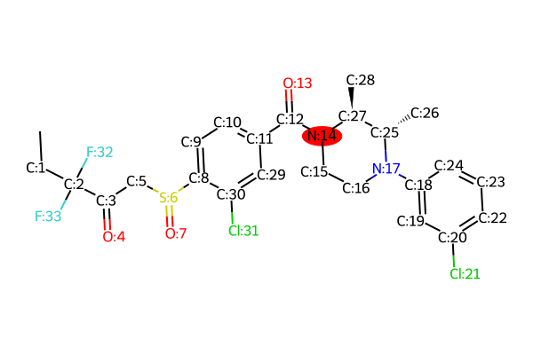
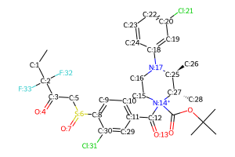

# Reaction Report for ***LEI_515***, Priority 13

**Selected Position:** `N:14`

**Selected Forward Reaction:** Boc amine deprotection

## Product
*Reaction site highlighted at position `N:14`*


**Product SMILES:** ```C[CH2:1][C:2]([C:3](=[O:4])[CH2:5][S:6](=[O:7])[c:8]1[cH:9][cH:10][c:11]([C:12](=[O:13])[N:14]2[CH2:15][CH2:16][N:17]([c:18]3[cH:19][c:20]([Cl:21])[cH:22][cH:23][cH:24]3)[C@@H:25]([CH3:26])[C@@H:27]2[CH3:28])[cH:29][c:30]1[Cl:31])([F:32])[F:33]```

## Proposed Transitions
### Transition 1
- **Forward Reaction:** Boc amine deprotection
- **Is Chemically Valid:** False
- **Is Template-based:** False
- **Reasoning:** This permutation is invalid. The specified reaction center, N:14, is a tertiary amide nitrogen within the product structure, not a primary or secondary amine. The forward reaction 'Boc amine deprotection' implies the product is a free amine and the reactant is a Boc-protected amine (a neutral carbamate). Applying the retrosynthetic protection step to a tertiary amide nitrogen is not a standard or plausible transformation. It would generate a highly reactive and unstable N-acyl quaternary ammonium salt, which is not a viable precursor for a deprotection reaction. The specified reaction name is inconsistent with the provided product structure at the indicated reaction center.
- **Reactant 1:** `C[CH2:1][C:2]([C:3](=[O:4])[CH2:5][S:6](=[O:7])[c:8]1[cH:9][cH:10][c:11]([C:12](=[O:13])[N+:14]2(C(=O)OC(C)(C)C)[CH2:15][CH2:16][N:17]([c:18]3[cH:19][c:20]([Cl:21])[cH:22][cH:23][cH:24]3)[C@@H:25]([CH3:26])[C@@H:27]2[CH3:28])[cH:29][c:30]1[Cl:31])([F:32])[F:33]`



