# Reaction Report for ***LEI_515***, Priority 3

**Selected Position:** `N:17 c:18`

**Selected Forward Reaction:** Buchwald-Hartwig/Ullmann-Goldberg/N-arylation secondary amine

## Product
*Reaction site highlighted at position `N:17 c:18`*
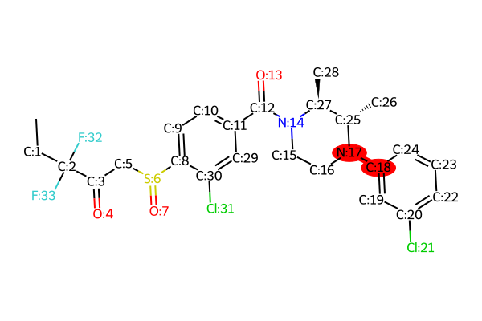

**Product SMILES:** ```C[CH2:1][C:2]([C:3](=[O:4])[CH2:5][S:6](=[O:7])[c:8]1[cH:9][cH:10][c:11]([C:12](=[O:13])[N:14]2[CH2:15][CH2:16][N:17]([c:18]3[cH:19][c:20]([Cl:21])[cH:22][cH:23][cH:24]3)[C@@H:25]([CH3:26])[C@@H:27]2[CH3:28])[cH:29][c:30]1[Cl:31])([F:32])[F:33]```

## Proposed Transitions
### Transition 1
- **Forward Reaction:** Buchwald-Hartwig/Ullmann-Goldberg/N-arylation secondary amine
- **Is Chemically Valid:** True
- **Is Template-based:** True
- **Reasoning:** This is the general template for an N-arylation reaction. The aryl partner is an activated aryl ring where the wildcard atom [*] represents a suitable leaving group from the class <Class:ArylHalideOrPseudohalide>, such as F, Cl, Br, I, OTf, OTs.
- **Reactant 1:** `C[CH2:1][C:2]([C:3](=[O:4])[CH2:5][S:6](=[O:7])[c:8]1[cH:9][cH:10][c:11]([C:12](=[O:13])[N:14]2[CH2:15][CH2:16][NH:17][C@@H:25]([CH3:26])[C@@H:27]2[CH3:28])[cH:29][c:30]1[Cl:31])([F:32])[F:33]`


- **Reactant 2:** `*[c:18]1[cH:19][c:20]([Cl:21])[cH:22][cH:23][cH:24]1`
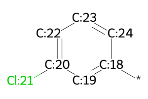


### Transition 2
- **Forward Reaction:** Buchwald-Hartwig/Ullmann-Goldberg/N-arylation secondary amine
- **Is Chemically Valid:** True
- **Is Template-based:** False
- **Reasoning:** This option is highly plausible. The reactants are stable. The high reactivity of the C-I bond compared to the C-Cl bonds present in both reactants allows for excellent chemoselectivity with standard palladium or copper catalysts. The reaction does not affect the existing stereocenters.
- **Reactant 1:** `C[CH2:1][C:2]([C:3](=[O:4])[CH2:5][S:6](=[O:7])[c:8]1[cH:9][cH:10][c:11]([C:12](=[O:13])[N:14]2[CH2:15][CH2:16][NH:17][C@@H:25]([CH3:26])[C@@H:27]2[CH3:28])[cH:29][c:30]1[Cl:31])([F:32])[F:33]`
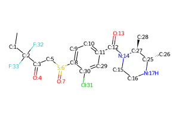


- **Reactant 2:** `I[c:18]1[cH:19][c:20]([Cl:21])[cH:22][cH:23][cH:24]1`
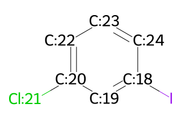


### Transition 3
- **Forward Reaction:** Buchwald-Hartwig/Ullmann-Goldberg/N-arylation secondary amine
- **Is Chemically Valid:** True
- **Is Template-based:** False
- **Reasoning:** This option is highly plausible. The reactants are stable. The greater reactivity of the C-Br bond versus the C-Cl bonds allows for high chemoselectivity under typical Buchwald-Hartwig conditions. The reaction does not affect the existing stereocenters.
- **Reactant 1:** `C[CH2:1][C:2]([C:3](=[O:4])[CH2:5][S:6](=[O:7])[c:8]1[cH:9][cH:10][c:11]([C:12](=[O:13])[N:14]2[CH2:15][CH2:16][NH:17][C@@H:25]([CH3:26])[C@@H:27]2[CH3:28])[cH:29][c:30]1[Cl:31])([F:32])[F:33]`


- **Reactant 2:** `Br[c:18]1[cH:19][c:20]([Cl:21])[cH:22][cH:23][cH:24]1`
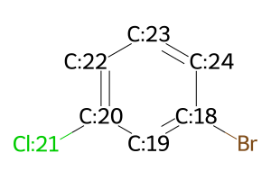


### Transition 4
- **Forward Reaction:** Buchwald-Hartwig/Ullmann-Goldberg/N-arylation secondary amine
- **Is Chemically Valid:** True
- **Is Template-based:** False
- **Reasoning:** This option is highly plausible. Aryl triflates are excellent electrophiles for N-arylation. The C-OTf bond is readily cleaved by palladium catalysts, enabling selective reaction in the presence of the less reactive C-Cl bonds. Reactants are stable and stereocenters are unaffected.
- **Reactant 1:** `C[CH2:1][C:2]([C:3](=[O:4])[CH2:5][S:6](=[O:7])[c:8]1[cH:9][cH:10][c:11]([C:12](=[O:13])[N:14]2[CH2:15][CH2:16][NH:17][C@@H:25]([CH3:26])[C@@H:27]2[CH3:28])[cH:29][c:30]1[Cl:31])([F:32])[F:33]`


- **Reactant 2:** `O(S(=O)(=O)C(F)(F)F)[c:18]1[cH:19][c:20]([Cl:21])[cH:22][cH:23][cH:24]1`
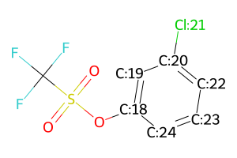


### Transition 5
- **Forward Reaction:** Buchwald-Hartwig/Ullmann-Goldberg/N-arylation secondary amine
- **Is Chemically Valid:** True
- **Is Template-based:** False
- **Reasoning:** This option is plausible but presents chemoselectivity challenges. The reaction would require a sophisticated catalyst system capable of selectively activating the desired C-Cl bond on 1,3-dichlorobenzene over the C-Cl bond present on the amine partner. Such selectivity is possible but requires careful optimization. The reaction is otherwise stereochemically sound.
- **Reactant 1:** `C[CH2:1][C:2]([C:3](=[O:4])[CH2:5][S:6](=[O:7])[c:8]1[cH:9][cH:10][c:11]([C:12](=[O:13])[N:14]2[CH2:15][CH2:16][NH:17][C@@H:25]([CH3:26])[C@@H:27]2[CH3:28])[cH:29][c:30]1[Cl:31])([F:32])[F:33]`


- **Reactant 2:** `Cl[c:18]1[cH:19][c:20]([Cl:21])[cH:22][cH:23][cH:24]1`
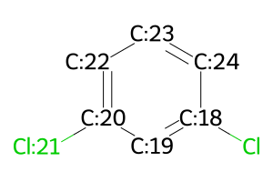


### Transition 6
- **Forward Reaction:** Buchwald-Hartwig/Ullmann-Goldberg/N-arylation secondary amine
- **Is Chemically Valid:** True
- **Is Template-based:** False
- **Reasoning:** This option is plausible. Aryl tosylates are viable substrates, generally intermediate in reactivity between aryl bromides and chlorides. Achieving selectivity over the C-Cl bonds would be likely but may depend on the specific catalyst and conditions. Reactants are stable and stereocenters are unaffected.
- **Reactant 1:** `C[CH2:1][C:2]([C:3](=[O:4])[CH2:5][S:6](=[O:7])[c:8]1[cH:9][cH:10][c:11]([C:12](=[O:13])[N:14]2[CH2:15][CH2:16][NH:17][C@@H:25]([CH3:26])[C@@H:27]2[CH3:28])[cH:29][c:30]1[Cl:31])([F:32])[F:33]`


- **Reactant 2:** `O(S(=O)(=O)c1ccc(C)cc1)[c:18]1[cH:19][c:20]([Cl:21])[cH:22][cH:23][cH:24]1`
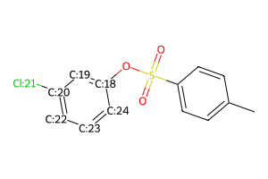


### Transition 7
- **Forward Reaction:** Buchwald-Hartwig/Ullmann-Goldberg/N-arylation secondary amine
- **Is Chemically Valid:** True
- **Is Template-based:** False
- **Reasoning:** This option is plausible but requires non-standard conditions. C-F bond activation for N-arylation is significantly more difficult than C-Cl, C-Br, or C-I activation and requires specialized, highly active catalyst systems. While chemically possible, it is a less common approach. The reactants are stable and stereocenters are unaffected.
- **Reactant 1:** `C[CH2:1][C:2]([C:3](=[O:4])[CH2:5][S:6](=[O:7])[c:8]1[cH:9][cH:10][c:11]([C:12](=[O:13])[N:14]2[CH2:15][CH2:16][NH:17][C@@H:25]([CH3:26])[C@@H:27]2[CH3:28])[cH:29][c:30]1[Cl:31])([F:32])[F:33]`


- **Reactant 2:** `F[c:18]1[cH:19][c:20]([Cl:21])[cH:22][cH:23][cH:24]1`
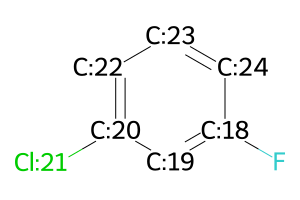


### Transition 8
- **Forward Reaction:** Buchwald-Hartwig/Ullmann-Goldberg/N-arylation secondary amine
- **Is Chemically Valid:** True
- **Is Template-based:** False
- **Reasoning:** This option is plausible. Aryl nosylates are highly reactive leaving groups, comparable to or exceeding triflates. Excellent chemoselectivity over the C-Cl bonds is expected. The reactants are stable and the reaction is stereochemically sound.
- **Reactant 1:** `C[CH2:1][C:2]([C:3](=[O:4])[CH2:5][S:6](=[O:7])[c:8]1[cH:9][cH:10][c:11]([C:12](=[O:13])[N:14]2[CH2:15][CH2:16][NH:17][C@@H:25]([CH3:26])[C@@H:27]2[CH3:28])[cH:29][c:30]1[Cl:31])([F:32])[F:33]`


- **Reactant 2:** `O(S(=O)(=O)c1ccc([N+](=O)[O-])cc1)[c:18]1[cH:19][c:20]([Cl:21])[cH:22][cH:23][cH:24]1`
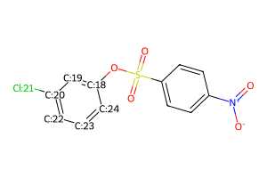


### Transition 9
- **Forward Reaction:** Buchwald-Hartwig/Ullmann-Goldberg/N-arylation secondary amine
- **Is Chemically Valid:** True
- **Is Template-based:** False
- **Reasoning:** This option is plausible. Aryl brosylates are also highly reactive leaving groups. High chemoselectivity is expected. A potential side-reaction could involve the aryl bromide on the brosylate group itself under some conditions, but typically the C-O(SO2R) bond is much more labile. The reaction is stereochemically sound.
- **Reactant 1:** `C[CH2:1][C:2]([C:3](=[O:4])[CH2:5][S:6](=[O:7])[c:8]1[cH:9][cH:10][c:11]([C:12](=[O:13])[N:14]2[CH2:15][CH2:16][NH:17][C@@H:25]([CH3:26])[C@@H:27]2[CH3:28])[cH:29][c:30]1[Cl:31])([F:32])[F:33]`


- **Reactant 2:** `O(S(=O)(=O)c1ccc(Br)cc1)[c:18]1[cH:19][c:20]([Cl:21])[cH:22][cH:23][cH:24]1`
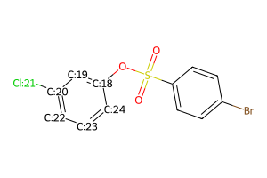


